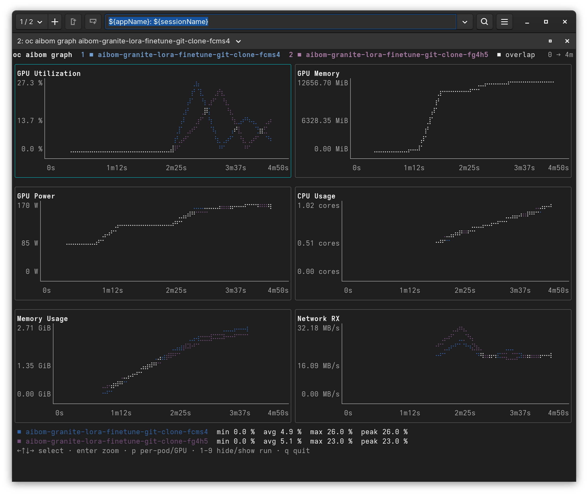
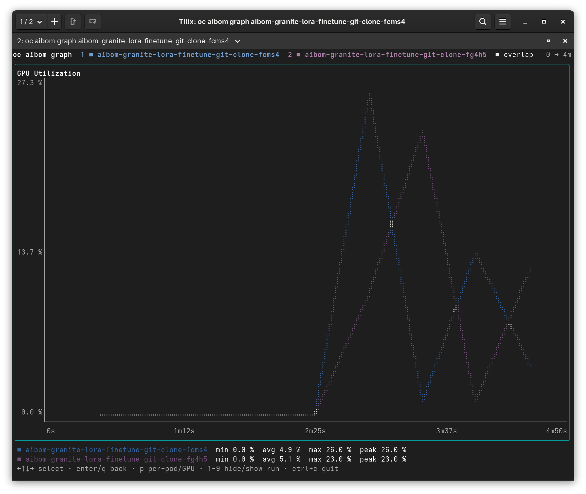
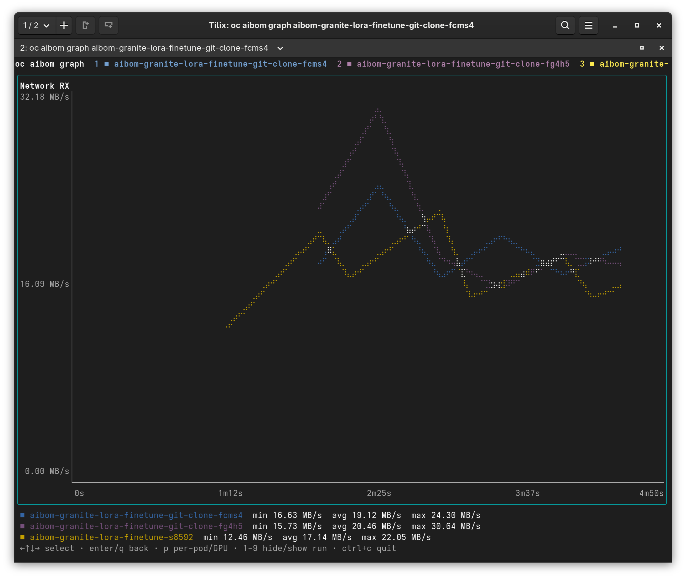

# oc aibom graph

```sh
oc aibom graph <name> [<name>...]
```

Charts the telemetry time series stored with one or more AIBOMs. The series are the downsampled per-metric lines `aibom-webhook-service` saves in an `AIBOMTelemetry` object when a run completes, so this works long after Prometheus's retention window has passed. AIBOMs created without a stored series (older ones, or runs where Prometheus had no data) are left out with a note.

```sh
oc aibom graph my-run
oc aibom graph run1 run2 run3 --metric gpu_utilization,memory_usage
oc aibom graph run1 run2 --pods
oc aibom graph run1 run2 --text --width 100
```

## Interactive view

On a terminal, `graph` opens a full-screen view (on the alternate screen, like `less` or `btop`) with one braille line chart per metric. Every run you name is overlaid in its own color, as in the console plugin's compare view.



- **Time axis:** each run is measured from its own start, on a shared axis that spans the longest run. A shorter run draws as a shorter line.
- **Value axis:** all runs in a panel share one scale, so heights are directly comparable.
- **Footer:** min, avg and max for the selected metric, per run, plus the per-bucket peak where one was recorded.

Press `enter` to zoom the selected metric full screen.



### Overlapping lines

A terminal cell can only hold one color, so where two runs' lines land in the same cell one would normally hide the other. Cells where the runs' points actually coincide are drawn white (the `■ overlap` entry in the header). In a cell that only holds points from several runs without coinciding, the run with the most points there wins.

To look at one run on its own, hide the others with `1`–`9`. The value scale stays fixed, so nothing jumps when you toggle.



### Keys

| Key | Action |
|-----|--------|
| `←` `→` `↑` `↓`, `h` `j` `k` `l`, `tab` | Select a metric |
| `enter`, `z` | Zoom the selected metric; again to go back |
| `1`–`9` | Hide or show that run (numbered as in the header) |
| `p` | Per-pod, per-GPU or per-container lines instead of each run's aggregate |
| `q`, `esc` | Go back from a zoom; otherwise quit |
| `ctrl+c` | Quit from anywhere |

`p` only changes a run that has more than one series stored for that metric. Detail is dropped at record time for a metric with more than 64 series, in which case the aggregate is shown.

## Text output

When stdout isn't a terminal (piped to a file or `less`), or with `--text`, `graph` prints one sparkline row per run per metric instead. The time and value scales are shared the same way as in the interactive view.

## Integrity

Before charting, each run's series is checked against the digest in its signed AIBOM data, the same check `describe` reports on its [`Telemetry Series:` line](describe.md#telemetry-series). A series that fails (`✗ DIGEST MISMATCH`) is not charted. The result for each run is printed when you quit, or before the output in text mode.

## Flags

| Flag | Meaning |
|------|---------|
| `--metric <keys>` | Only graph these comma-separated metric keys, for example `gpu_utilization,memory_usage`. An unknown key lists the keys that exist. Default: all. |
| `--pods` | Start with per-pod, per-GPU and per-container lines (toggle with `p`). |
| `--text` | Print sparklines instead of opening the interactive view. |
| `--width <n>` | Text-mode width in columns. Default: the terminal width. |

Metric keys are the ones stored in the series: `gpu_utilization`, `gpu_memory_used`, `gpu_power`, `cpu_usage`, `memory_usage`, `network_receive`, `network_transmit`, `storage_read_throughput` and `storage_write_throughput`, plus vLLM's `time_to_first_token_seconds`, `inter_token_latency_seconds`, `num_requests_running`, `num_requests_waiting`, `kv_cache_usage`, `prompt_throughput` and `generation_throughput` for inference runs.

Reading a series needs permission to `get` `aibomtelemetries`. The webhook chart's `aibom-view` ClusterRole grants it to anyone who can already view AIBOMs.
